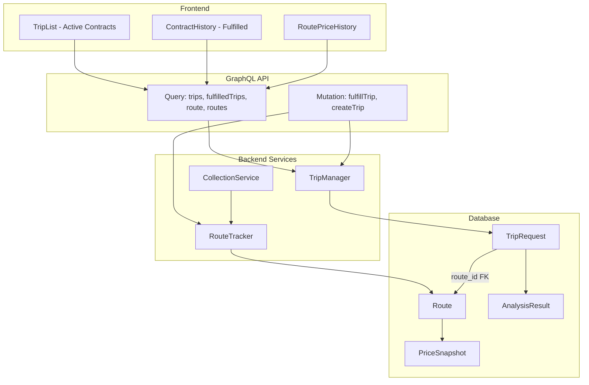

# Design Document: Contract History and Route Tracking

## Overview

This design introduces two core concepts to the Flight Deal Tracker:

1. **Route Entity** — A deduplicated origin-destination pair that owns price collection. Multiple contracts (TripRequests) sharing the same route share a single collection run, eliminating redundant API calls.
2. **Contract Lifecycle** — Contracts gain a `status` field (`active` | `fulfilled`) with a fulfillment timestamp. Fulfilled contracts move to a history view while their route continues collecting data.

The collection service is refactored from iterating individual contracts to iterating distinct routes. Price snapshots are linked to routes rather than contracts. A migration script transitions existing data to the new structure.

## Architecture



The key architectural change is the introduction of the `Route` table as the owner of price data. `TripRequest` gains a foreign key to `Route` and a `status`/`fulfilled_at` pair. The `CollectionService` queries distinct active routes instead of individual trip requests.

## Components and Interfaces

### Route Model (New)

Represents a unique origin-destination airport pair. Owns all price snapshots for that pair.

### RouteTracker Service (New)

Responsibilities:
- `get_or_create_route(origin, destination)` — Finds existing route or creates one. Called during trip creation.
- `mark_dormant(route_id)` — Sets a route as dormant when no active contracts reference it and no collection has occurred in 90 days.
- `reactivate_route(route_id)` — Reactivates a dormant route when a new contract references it.
- `get_active_routes()` — Returns all routes that should be collected (not dormant).

### TripManager Service (Modified)

New methods:
- `fulfill_trip(trip_id)` — Sets status to "fulfilled", records `fulfilled_at` timestamp.
- `list_fulfilled_trips()` — Returns all fulfilled contracts for the history view.

Modified methods:
- `create_trip(input)` — Now also calls `RouteTracker.get_or_create_route()` to link the contract to a route.

### CollectionService (Modified)

- `collect_all()` — Refactored to iterate `RouteTracker.get_active_routes()` instead of individual trip requests.
- `_store_snapshots(route_id, prices)` — Stores snapshots linked to route instead of trip_request.
- After collection, triggers analysis for each active contract on that route.

### GraphQL Schema (Modified)

New queries:
- `fulfilledTrips` — Returns fulfilled contracts with their historical data.
- `route(routeId: Int!)` — Returns a route with full price history.
- `routes` — Returns all tracked routes.

New mutations:
- `fulfillTrip(tripId: Int!)` — Marks a contract as fulfilled.

New types:
- `RouteType` — id, origin, destination, status, priceHistory, activeContracts.

### Frontend Components (New/Modified)

- `ContractHistory` page — Lists fulfilled contracts with fulfillment date and final recommendation.
- `RoutePriceHistory` component — Shows all-time price data for a route, with markers for contract activity periods.
- `TripList` — Updated to only show active contracts (already filtered by `is_active`, now also by status).
- `TripDetail` — Adds "Mark as Fulfilled" button.

## Data Models

### Route (New Table: `routes`)

| Column | Type | Constraints | Description |
|--------|------|-------------|-------------|
| id | Integer | PK, auto-increment | Unique route identifier |
| origin | String(3) | NOT NULL | Origin IATA code |
| destination | String(3) | NOT NULL | Destination IATA code |
| status | String(10) | NOT NULL, default "active" | "active" or "dormant" |
| last_collected_at | DateTime | nullable | Timestamp of last successful collection |
| created_at | DateTime | NOT NULL, default now | Record creation time |

**Unique constraint:** `(origin, destination)`

### TripRequest (Modified)

New columns:

| Column | Type | Constraints | Description |
|--------|------|-------------|-------------|
| route_id | Integer | FK → routes.id, NOT NULL | Link to the route |
| status | String(10) | NOT NULL, default "active" | "active" or "fulfilled" |
| fulfilled_at | DateTime | nullable | When the contract was fulfilled |

The existing `is_active` column is retained for backward compatibility during migration but will be derived from `status` going forward.

### PriceSnapshot (Modified)

Changed columns:

| Column | Type | Constraints | Description |
|--------|------|-------------|-------------|
| route_id | Integer | FK → routes.id, NOT NULL | Link to route (replaces trip_request_id) |
| trip_request_id | Integer | FK → trip_requests.id, nullable | Retained for historical reference, nullable for new snapshots |

New snapshots will have `route_id` set and `trip_request_id` set to NULL. Migrated snapshots retain both for traceability.

### SQLAlchemy Model Definitions

```python
class Route(Base):
    __tablename__ = "routes"

    id = Column(Integer, primary_key=True)
    origin = Column(String(3), nullable=False)
    destination = Column(String(3), nullable=False)
    status = Column(String(10), nullable=False, default="active")  # "active" | "dormant"
    last_collected_at = Column(DateTime, nullable=True)
    created_at = Column(DateTime, default=datetime.utcnow)

    __table_args__ = (UniqueConstraint("origin", "destination", name="uq_route_origin_dest"),)

    price_snapshots = relationship("PriceSnapshot", back_populates="route")
    trip_requests = relationship("TripRequest", back_populates="route")


class TripRequest(Base):  # Modified
    # ... existing columns ...
    route_id = Column(Integer, ForeignKey("routes.id"), nullable=False)
    status = Column(String(10), nullable=False, default="active")  # "active" | "fulfilled"
    fulfilled_at = Column(DateTime, nullable=True)

    route = relationship("Route", back_populates="trip_requests")


class PriceSnapshot(Base):  # Modified
    # ... existing columns ...
    route_id = Column(Integer, ForeignKey("routes.id"), nullable=False)
    trip_request_id = Column(Integer, ForeignKey("trip_requests.id"), nullable=True)  # now nullable

    route = relationship("Route", back_populates="price_snapshots")
```

### Migration Strategy

A migration script (`scripts/migrate_routes.py`) will:

1. Create the `routes` table.
2. For each distinct `(origin, destination)` in `trip_requests`, insert a `Route` record.
3. Update each `TripRequest` with the corresponding `route_id`.
4. Update each `PriceSnapshot` with the `route_id` derived from its `trip_request.route_id`.
5. Set `status = "active"` on all existing trip requests where `is_active = True`, and `status = "fulfilled"` where `is_active = False`.
6. Make `PriceSnapshot.trip_request_id` nullable.
7. Add NOT NULL constraint on `TripRequest.route_id` and `PriceSnapshot.route_id`.


## Correctness Properties

*A property is a characteristic or behavior that should hold true across all valid executions of a system — essentially, a formal statement about what the system should do. Properties serve as the bridge between human-readable specifications and machine-verifiable correctness guarantees.*

### Property 1: Route Uniqueness Invariant

*For any* set of routes in the database, no two routes shall share the same (origin, destination) pair. The routes table maintains a strict one-to-one mapping between origin-destination pairs and route records.

**Validates: Requirements 1.1**

### Property 2: get_or_create Route Idempotence

*For any* origin-destination pair, calling `get_or_create_route(origin, destination)` multiple times shall always return the same route record, and the total number of routes with that pair shall remain exactly one. Creating N contracts with the same origin-destination produces exactly 1 route.

**Validates: Requirements 1.2, 1.3, 7.3**

### Property 3: Collection Deduplication

*For any* set of active contracts, the number of collection runs in a single cycle shall equal the number of distinct routes referenced by those contracts, not the number of contracts themselves.

**Validates: Requirements 1.4, 6.1**

### Property 4: Snapshots Stored at Route Level

*For any* newly created price snapshot (post-migration), the snapshot shall have a non-null `route_id` linking it to the route that was collected.

**Validates: Requirements 1.5, 6.2**

### Property 5: Fulfillment Sets Status and Timestamp

*For any* active contract, calling `fulfill_trip(trip_id)` shall result in `status == "fulfilled"` and `fulfilled_at` being a non-null timestamp that is less than or equal to the current time.

**Validates: Requirements 2.1**

### Property 6: Fulfillment Preserves Historical Data

*For any* contract with N price snapshots and M analysis results, after fulfillment, the count of associated price snapshots shall still be N and analysis results shall still be M.

**Validates: Requirements 2.2**

### Property 7: Contract List Partitioning by Status

*For any* contract in the system, it shall appear in exactly one of the active contracts list or the fulfilled contracts list, determined by its status field. Active contracts have status "active"; fulfilled contracts have status "fulfilled" with a non-null fulfilled_at and include origin, destination, date ranges, and fulfillment date.

**Validates: Requirements 2.3, 2.4, 4.1**

### Property 8: Route Persists After Last Contract Fulfilled

*For any* route where all referencing contracts are fulfilled, the route's status shall remain "active" (not dormant) immediately after fulfillment. Route dormancy is only triggered by the 90-day inactivity rule, not by contract fulfillment.

**Validates: Requirements 2.5, 3.1**

### Property 9: Dormancy Lifecycle Round-Trip

*For any* route with no active contracts and `last_collected_at` older than 90 days, the route shall be marked dormant and excluded from collection. *For any* dormant route, creating a new contract referencing it shall reactivate it to "active" status and include it in collection.

**Validates: Requirements 3.2, 3.3, 3.4**

### Property 10: Route Price History Completeness

*For any* route, querying its price history shall return all price snapshots ever collected for that route (across all time periods and all contracts), each including a collection timestamp and flight details (airline, flight number, departure/arrival times, price).

**Validates: Requirements 5.1, 5.2**

### Property 11: Route Data Accessible to All Contracts

*For any* route with N active contracts, after a collection run stores K snapshots for that route, all N contracts shall have access to those K snapshots for analysis purposes.

**Validates: Requirements 6.3**

### Property 12: Collection Error Resilience

*For any* set of routes where one route's collection fails, the remaining routes shall still be collected successfully. A single route failure shall not abort the collection cycle.

**Validates: Requirements 6.4**

### Property 13: Migration Data Integrity

*For any* existing price snapshot with a `trip_request_id`, after migration, the snapshot shall have a `route_id` that matches a route with the same (origin, destination) as the snapshot's original contract, and the `trip_request_id` shall be preserved (not nulled).

**Validates: Requirements 8.1, 8.2, 8.3**

## Error Handling

| Scenario | Handling Strategy |
|----------|-------------------|
| Route collection fails (API error) | Log error, skip route, continue with remaining routes. No partial snapshots stored. |
| Fulfillment of already-fulfilled contract | Return error: "Contract already fulfilled." No state change. |
| Fulfillment of non-existent contract | Raise `TripNotFoundError` (existing pattern). |
| Migration encounters orphaned snapshot | Create route from snapshot's contract origin-dest, link snapshot. |
| Duplicate route creation (race condition) | Database unique constraint catches it; retry with SELECT. |
| Dormancy check during active collection | Dormancy check runs separately from collection; no conflict. |
| Contract creation with invalid IATA codes | Existing validation in `TripService._validate()` rejects before route lookup. |

## Testing Strategy

### Property-Based Testing

Library: **Hypothesis** (Python) for backend properties, **fast-check** (TypeScript) for frontend logic if applicable.

Each correctness property above maps to a single property-based test with minimum 100 iterations. Tests are tagged with:

```
# Feature: contract-history-and-route-tracking, Property {N}: {title}
```

Key property tests:

1. **Route uniqueness** — Generate random (origin, dest) pairs, call get_or_create multiple times, assert unique constraint holds.
2. **get_or_create idempotence** — Generate N contracts with overlapping routes, verify route count equals distinct pairs.
3. **Collection deduplication** — Generate contracts with shared routes, mock sources, verify source.search_flights called once per route.
4. **Fulfillment lifecycle** — Generate random active contracts, fulfill them, verify status/timestamp/list membership.
5. **Dormancy round-trip** — Generate routes with various last_collected_at values, run dormancy check, verify correct routes are dormant, then reactivate.
6. **Migration integrity** — Generate random existing data (contracts + snapshots), run migration logic, verify all snapshots have correct route_id and preserved trip_request_id.

### Unit Tests

Specific examples and edge cases:

- Fulfill a contract that has zero price snapshots (should still work).
- Create two contracts PHX→ATL and ATL→PHX — these are different routes.
- Dormancy boundary: route with last_collected_at exactly 90 days ago (should NOT be dormant — only > 90 days).
- Migration with a contract that has `is_active=False` — should get status "fulfilled".
- Collection with zero active routes — should complete without error.
- Route price history query on a route with 10,000+ snapshots — verify pagination/performance.

### Integration Tests

- End-to-end: Create contract → run collection → verify snapshots on route → fulfill contract → verify history view → verify route still collects.
- Migration script: Run against a test database seeded with realistic data, verify all constraints pass.
- GraphQL: Test `fulfilledTrips` query returns correct shape, `fulfillTrip` mutation transitions state correctly.

### Test Configuration

- Property tests: 100 iterations minimum per property
- Each property test references its design document property number
- Tag format: `Feature: contract-history-and-route-tracking, Property {N}: {title}`
- Property-based testing library: Hypothesis (do NOT implement PBT from scratch)
- Both unit tests and property tests are required — they are complementary
