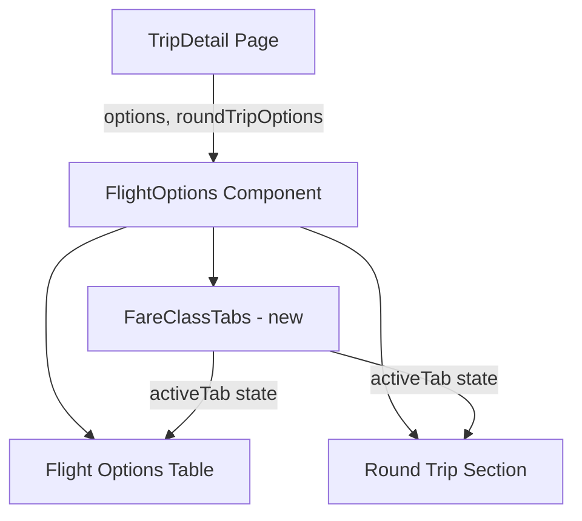

# Design Document: Fare Class Tabs

## Overview

This feature adds a tabbed interface to the existing `FlightOptions` component that allows users to filter displayed flights by fare class (Economy, Premium Economy, Business, First). The implementation is entirely frontend — no backend or API changes are required since `fareClass` is already present on each `FlightOption` and `RoundTripOption`.

The tab bar renders above the flight table, shows badge counts per fare class, and filters both the one-way options table and the round-trip combinations section based on the active tab selection.

## Architecture

The feature follows the existing component architecture:



**Key decisions:**
- **Single component approach**: The tab bar is implemented as an internal sub-component (`FareClassTabs`) within `FlightOptions.tsx` rather than a separate file, consistent with how `SegmentDetail` and `FlightRow` are already defined in the same file.
- **State lives in FlightOptions**: The `activeTab` state is managed in the parent `FlightOptions` component and passed down. Filtering is performed at the `FlightOptions` level before passing data to the table/round-trip renderers.
- **No new dependencies**: Uses React's built-in `useState` for tab state and `useMemo` for memoized filtering. No external tab library needed.

## Components and Interfaces

### FareClassTabs (new internal component)

```typescript
interface FareClassTabsProps {
  activeTab: string;
  onTabChange: (fareClass: string) => void;
  counts: Record<string, number>;
}
```

Renders the horizontal tab bar with labels and badge counts.

### Updated FlightOptions component

The existing `FlightOptions` component gains:
- `activeTab` state (defaults to `"Economy"`)
- Filtering logic applied to `options` and `roundTripOptions` before rendering
- Empty state rendering when filtered results are empty

### Constants

```typescript
const FARE_CLASS_ORDER = ['Economy', 'Premium Economy', 'Business', 'First'] as const;
```

### Filtering Logic (pure function)

```typescript
function filterByFareClass(options: FlightOption[], fareClass: string): FlightOption[] {
  return options.filter(o => o.fareClass.toLowerCase() === fareClass.toLowerCase());
}

function filterRoundTripsByFareClass(
  roundTrips: RoundTripOption[],
  fareClass: string
): RoundTripOption[] {
  const lower = fareClass.toLowerCase();
  return roundTrips.filter(
    rt => rt.outbound.fareClass.toLowerCase() === lower
       && rt.returnFlight.fareClass.toLowerCase() === lower
  );
}

function countByFareClass(options: FlightOption[]): Record<string, number> {
  const counts: Record<string, number> = {};
  for (const fc of FARE_CLASS_ORDER) {
    counts[fc] = options.filter(o => o.fareClass.toLowerCase() === fc.toLowerCase()).length;
  }
  return counts;
}

function formatBadgeCount(count: number): string {
  return count > 999 ? '999+' : String(count);
}
```

## Data Models

No new data models are introduced. The feature operates on the existing interfaces:

- `FlightOption` — already has `fareClass: string`
- `RoundTripOption` — contains `outbound: FlightOption` and `returnFlight: FlightOption`, each with `fareClass`

### State

| State | Type | Default | Description |
|-------|------|---------|-------------|
| `activeTab` | `string` | `"Economy"` | Currently selected fare class tab |

### Derived Data (via useMemo)

| Derived | Computation |
|---------|-------------|
| `filteredOptions` | `filterByFareClass(options, activeTab)` |
| `filteredRoundTrips` | `filterRoundTripsByFareClass(roundTripOptions, activeTab)` |
| `counts` | `countByFareClass(options)` |

## Correctness Properties

*A property is a characteristic or behavior that should hold true across all valid executions of a system — essentially, a formal statement about what the system should do. Properties serve as the bridge between human-readable specifications and machine-verifiable correctness guarantees.*

### Property 1: One-way filtering correctness

*For any* array of flight options and *for any* selected fare class, every option in the filtered result shall have a fare class that matches the selected fare class (case-insensitive), and no option matching the selected fare class shall be excluded from the result.

**Validates: Requirements 1.5, 2.2**

### Property 2: Round-trip filtering correctness

*For any* array of round-trip options and *for any* selected fare class, every round-trip combination in the filtered result shall have both its outbound and return flight fare classes matching the selected fare class (case-insensitive), and no fully-matching combination shall be excluded.

**Validates: Requirements 2.3**

### Property 3: Case-insensitive matching consistency

*For any* array of flight options where fare class strings have arbitrary casing, the filtering and counting functions shall produce identical results regardless of the casing of the fare class values in the data, as long as they represent the same fare class name.

**Validates: Requirements 2.4, 4.4**

### Property 4: Badge count accuracy

*For any* array of flight options, the count badge for each fare class shall equal the number of options in the array whose fare class matches that tab's fare class (case-insensitive), and the sum of all badge counts shall equal the total number of options.

**Validates: Requirements 4.1**

### Property 5: Empty state message includes fare class name

*For any* selected fare class where the filtered one-way options list is empty, the rendered empty-state message shall contain the name of the selected fare class. Similarly, for any selected fare class where the filtered round-trip list is empty, the round-trip empty-state message shall contain the name of the selected fare class.

**Validates: Requirements 3.1, 3.2**

## Error Handling

| Scenario | Handling |
|----------|----------|
| `options` is `undefined` or empty array | Existing behavior preserved — show "No flight data available" message before tabs render |
| `fareClass` field is missing/undefined on an option | Treat as non-matching for all tabs (won't appear in any filtered view) |
| `roundTripOptions` is `undefined` | Round-trip section not rendered (existing behavior) |
| All fare classes have zero options | All tabs show "0" badge; each tab shows its respective empty-state message |
| Unknown fare class value in data (e.g., "Premium") | Won't match any tab — effectively hidden from all views |

## Testing Strategy

### Property-Based Tests

The pure filtering and counting functions (`filterByFareClass`, `filterRoundTripsByFareClass`, `countByFareClass`, `formatBadgeCount`) are ideal candidates for property-based testing since they are pure functions with clear input/output behavior and a large input space.

**Library**: [fast-check](https://github.com/dubzzz/fast-check) (JavaScript/TypeScript PBT library)

**Configuration**: Minimum 100 iterations per property test.

**Tag format**: `Feature: fare-class-tabs, Property {number}: {property_text}`

Each correctness property maps to a single property-based test:
- Property 1 → Test `filterByFareClass` with generated arrays of FlightOption objects
- Property 2 → Test `filterRoundTripsByFareClass` with generated RoundTripOption arrays
- Property 3 → Test filtering/counting with randomly-cased fare class strings
- Property 4 → Test `countByFareClass` with generated arrays, verify sum invariant
- Property 5 → Test empty state message rendering with fare class names

### Unit Tests (Example-Based)

- Tab order renders as Economy, Premium Economy, Business, First
- Default active tab is Economy on initial render
- Active tab has cyan styling, inactive tabs have #555577
- Clicking already-active tab produces no state change
- Badge displays "999+" when count exceeds 999
- Empty state messages are distinct for one-way vs round-trip sections
- Table header is not rendered when one-way options are empty for selected fare class
- Font families: Orbitron for labels, Share Tech Mono for badges

### Integration Tests

- Full component render with mixed fare class data, click each tab, verify correct options shown
- Responsive behavior at viewport breakpoints (1024px threshold)
