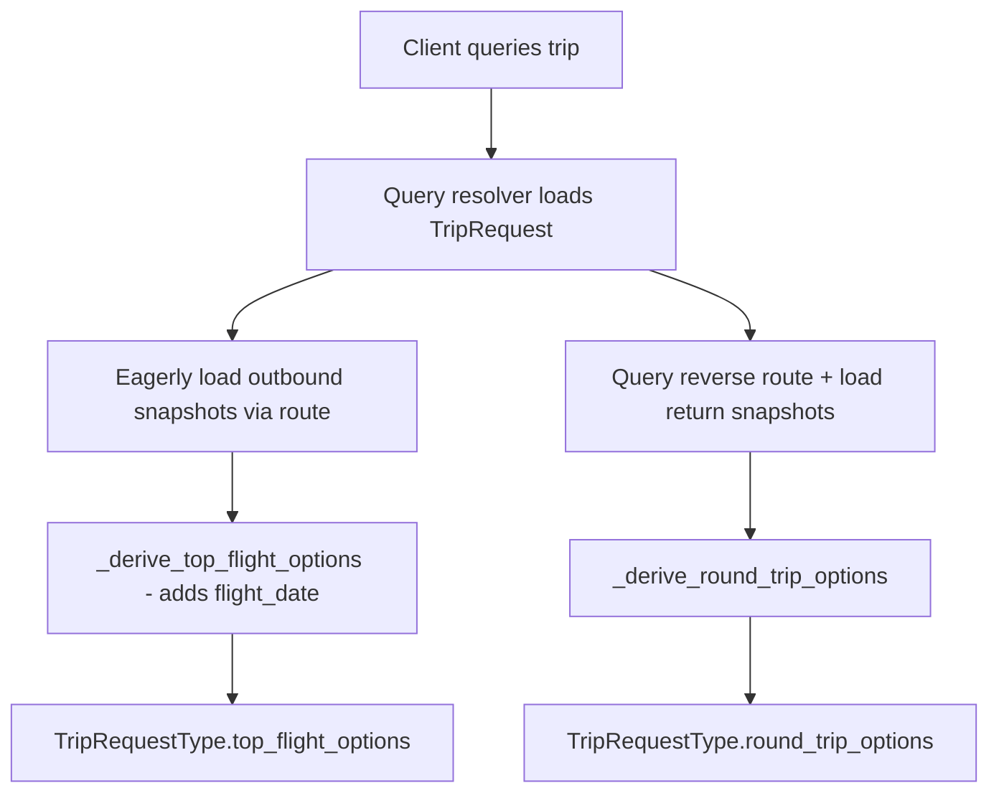

# Design Document: Flight Date and Round-Trip Display

## Overview

This feature extends the GraphQL API to expose flight dates on one-way options and introduce round-trip flight combinations. The core changes are:

1. **Add `flight_date`** to `FlightOptionType` so clients know which calendar date each option departs on.
2. **Introduce `RoundTripOptionType`** that pairs an outbound flight with a return flight and exposes a combined price.
3. **Implement pairing logic** that forms the cartesian product of outbound × return snapshots, filters by date/time constraints, sorts by combined price, and returns the top 10.
4. **Source return flight data** from the reverse route (destination→origin) by querying the database for the matching route's latest snapshots.
5. **Expose a new field** `round_trip_options` on `TripRequestType`.

The existing `top_flight_options` field and its filtering/sorting behavior remain unchanged except for the addition of `flight_date`.

## Architecture

The feature is entirely within the GraphQL schema layer (`app/graphql_api/schema.py`). No new database tables or models are needed — `PriceSnapshot` already stores `flight_date`. The pairing logic is a pure function operating on two lists of snapshots plus trip constraints.



### Data Flow for Round-Trip Resolution

1. The resolver fetches the `TripRequest` with its associated `Route` (outbound: origin→destination).
2. It queries for the **reverse route** (destination→origin) by looking up `Route` where `origin=trip.destination` and `destination=trip.origin`.
3. It loads the latest batch of `PriceSnapshot` records for the reverse route.
4. The pairing function receives outbound snapshots, return snapshots, and trip constraints, then produces up to 10 `RoundTripOptionType` results.

## Components and Interfaces

### New GraphQL Types

```python
@strawberry.type
class FlightOptionType:
    """Updated — adds flight_date."""
    airline: str
    flight_number: str
    departure_time: str
    arrival_time: str
    fare_class: str
    price_cents: int
    flight_date: date          # NEW
    stops: int
    total_duration_minutes: int
    segments: list[FlightSegmentType]


@strawberry.type
class RoundTripOptionType:
    """A paired outbound + return flight combination."""
    outbound: FlightOptionType
    return_flight: FlightOptionType
    combined_price_cents: int
```

### Updated `TripRequestType`

```python
@strawberry.type
class TripRequestType:
    # ... existing fields ...
    top_flight_options: list[FlightOptionType]
    round_trip_options: list[RoundTripOptionType]  # NEW
```

### New/Updated Helper Functions

| Function | Signature | Purpose |
|----------|-----------|---------|
| `_derive_top_flight_options` | `(snapshots, latest_arrival_time) -> list[FlightOptionType]` | Updated to include `flight_date` in output |
| `_derive_round_trip_options` | `(outbound_snapshots, return_snapshots, trip) -> list[RoundTripOptionType]` | NEW — pairing logic |
| `_get_latest_batch` | `(snapshots) -> list[PriceSnapshot]` | Extracted helper to get the latest 5-min batch |
| `_map_trip_to_type` | `(trip, return_snapshots) -> TripRequestType` | Updated to accept return snapshots and populate `round_trip_options` |

### Resolver Changes

The `trip` and `trips` query resolvers need to:
1. Look up the reverse route for each trip that has return dates.
2. Load the reverse route's price snapshots.
3. Pass them to `_map_trip_to_type`.

This requires an additional database query per trip (or a batch query for the `trips` list resolver).

## Data Models

No schema changes are needed. The existing `PriceSnapshot.flight_date` column (type `Date`) already stores the required data.

### Relevant Existing Schema

```
PriceSnapshot:
  - id: Integer (PK)
  - route_id: Integer (FK → routes.id)
  - trip_request_id: Integer (FK → trip_requests.id, nullable)
  - airline_code: String(3)
  - flight_number: String(10)
  - departure_time: String(25)
  - arrival_time: String(25)
  - fare_class: String(20)
  - price_cents: Integer
  - flight_date: Date          ← already exists
  - stops: Integer
  - total_duration_minutes: Integer
  - segments_json: Text (nullable)
  - collected_at: DateTime

Route:
  - id: Integer (PK)
  - origin: String(3)
  - destination: String(3)
  - status: String(10)
  - last_collected_at: DateTime (nullable)
```

### Reverse Route Lookup

A trip with `origin=ATL, destination=LAX` has its outbound route as `Route(origin=ATL, destination=LAX)`. The return route is `Route(origin=LAX, destination=ATL)`. This reverse route may or may not exist — if it doesn't exist, no return snapshots are available and `round_trip_options` will be empty.

## Correctness Properties

*A property is a characteristic or behavior that should hold true across all valid executions of a system — essentially, a formal statement about what the system should do. Properties serve as the bridge between human-readable specifications and machine-verifiable correctness guarantees.*

### Property 1: Flight date preservation

*For any* valid PriceSnapshot with a non-null flight_date, when mapped to a FlightOptionType, the resulting flight_date field SHALL equal the original snapshot's flight_date.

**Validates: Requirements 1.1**

### Property 2: Round-trip presence determined by return dates

*For any* TripRequest, if earliest_return and latest_return are both defined and there exist valid outbound and return snapshots that satisfy all constraints, then round_trip_options SHALL be non-empty. Conversely, if earliest_return or latest_return is None, then round_trip_options SHALL be an empty list.

**Validates: Requirements 2.1, 3.4**

### Property 3: Combined price correctness

*For any* RoundTripOptionType produced by the pairing logic, combined_price_cents SHALL equal outbound.price_cents + return_flight.price_cents.

**Validates: Requirements 2.3**

### Property 4: Round-trip output invariants

*For any* list of RoundTripOptionType results returned by `_derive_round_trip_options`, the list SHALL be sorted by combined_price_cents in ascending order AND the list length SHALL be at most 10.

**Validates: Requirements 2.4, 2.5**

### Property 5: Round-trip date and time validity

*For any* RoundTripOptionType produced given a TripRequest with constraints, ALL of the following SHALL hold:
- outbound.flight_date >= trip.earliest_departure
- outbound.flight_date <= trip.latest_departure
- return_flight.flight_date >= trip.earliest_return
- return_flight.flight_date <= trip.latest_return
- return_flight.flight_date >= outbound.flight_date
- If trip.latest_return_time is set: _extract_time(return_flight.arrival_time) <= trip.latest_return_time

**Validates: Requirements 4.1, 4.2, 4.3, 4.4**

### Property 6: One-way time filtering

*For any* FlightOptionType in top_flight_options where the TripRequest has latest_departure_time set, _extract_time(flight.arrival_time) SHALL be <= latest_departure_time.

**Validates: Requirements 5.1**

### Property 7: One-way output invariants

*For any* list of FlightOptionType results returned by `_derive_top_flight_options`, the list SHALL be sorted by price_cents in ascending order AND the list length SHALL be at most 10.

**Validates: Requirements 5.2, 5.3**

## Error Handling

| Scenario | Handling |
|----------|----------|
| Reverse route does not exist | `round_trip_options` returns empty list — no error raised |
| Reverse route exists but has no snapshots | `round_trip_options` returns empty list |
| No valid pairings after filtering | `round_trip_options` returns empty list |
| Outbound snapshots empty | Both `top_flight_options` and `round_trip_options` return empty lists |
| `segments_json` is malformed | Existing `_parse_segments_json` returns empty list (no change) |
| `arrival_time` format unexpected | `_extract_time` falls back to "23:59" (existing behavior) |
| Database query for reverse route fails | Let exception propagate to GraphQL error handler (standard Strawberry behavior) |

## Testing Strategy

### Property-Based Tests (pytest + Hypothesis)

The pairing logic and mapping functions are pure functions (given snapshots and constraints, produce output). This makes them ideal for property-based testing.

**Library:** [Hypothesis](https://hypothesis.readthedocs.io/) for Python  
**Configuration:** Minimum 100 examples per property test  
**Tag format:** `# Feature: flight-date-and-roundtrip-display, Property {N}: {title}`

Each correctness property (1–7) maps to a single Hypothesis test:

1. **Property 1** — Generate random PriceSnapshot-like objects, map them, assert flight_date preserved.
2. **Property 2** — Generate TripRequests with/without return dates and snapshot lists, assert presence/absence of round-trip results.
3. **Property 3** — Generate pairs of snapshots, run pairing, assert arithmetic identity.
4. **Property 4** — Generate snapshot lists, run pairing, assert sorted + length ≤ 10.
5. **Property 5** — Generate snapshots with various dates/times and trip constraints, run pairing, assert all date/time constraints hold on every output.
6. **Property 6** — Generate snapshots with various arrival times and a latest_departure_time, run `_derive_top_flight_options`, assert time filter on every output.
7. **Property 7** — Generate snapshot lists, run `_derive_top_flight_options`, assert sorted + length ≤ 10.

### Unit Tests (pytest)

Focused example-based tests for:
- Empty snapshot lists → empty results
- Single outbound + single return → one round-trip option
- Return date before outbound date → filtered out (no valid pairings)
- Exactly 10 valid pairings → returns all 10
- More than 10 valid pairings → returns cheapest 10
- Trip with no return dates → empty round_trip_options
- `_extract_time` edge cases (various formats)

### Integration Tests

- GraphQL query for a trip with return dates returns `round_trip_options` field
- GraphQL query for a trip without return dates returns empty `round_trip_options`
- `flight_date` field is present and correctly typed in `top_flight_options` response
