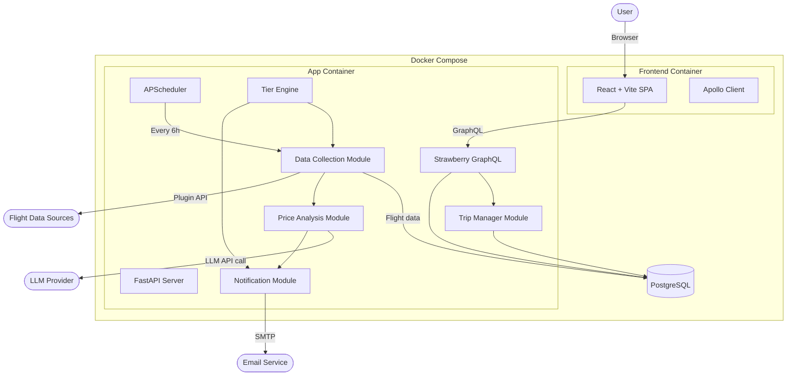
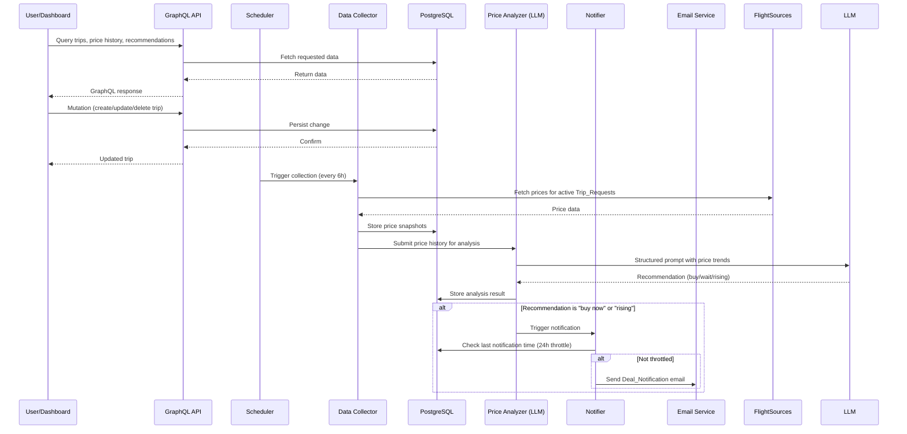
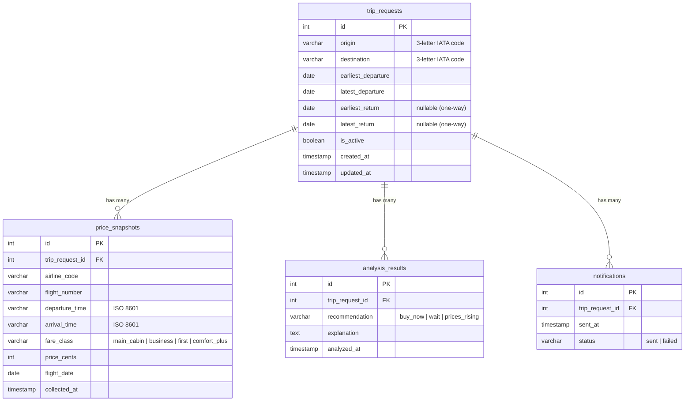

# Design Document: Flight Deal Tracker

## Overview

The Flight Deal Tracker is a full-stack Dockerized application that monitors flight prices for user-defined travel windows, provides LLM-powered purchase timing recommendations, and delivers results through both a web dashboard and email notifications. The system uses a tiered airline preference system and targets main cabin fares while surfacing premium upgrade opportunities.

The application runs as a set of services orchestrated by docker-compose: a Python backend (FastAPI hosting a Strawberry GraphQL endpoint), a React frontend (Vite + Apollo Client), a scheduler for periodic price collection, and a PostgreSQL database for persistence.

### Key Design Decisions

- **Python with FastAPI + Strawberry GraphQL**: FastAPI serves as the HTTP server hosting the GraphQL endpoint via Strawberry. Strawberry integrates natively with FastAPI's async support and provides type-safe schema definition using Python dataclasses. GraphQL enables the dashboard to fetch exactly the data it needs in flexible, nested queries (e.g., a trip with its price history, latest analysis, and top flight options in a single request).
- **React with Vite + Apollo Client**: Vite provides fast development builds and optimized production bundles. Apollo Client handles GraphQL query management, caching, and state. This is a lightweight, modern frontend stack well-suited for a personal project dashboard.
- **PostgreSQL with SQLAlchemy async**: Provides robust relational storage for trip requests and time-series price history. Volume-mounted for data persistence across container restarts. SQLAlchemy async (with asyncpg) integrates cleanly with FastAPI's async request handling.
- **APScheduler**: Lightweight in-process scheduler for periodic price collection (every 6 hours) and notification throttling. Runs within the app container process.
- **Plugin architecture for data sources**: Airline data providers implement a common abstract interface, allowing new airlines or data providers to be added without modifying core logic.
- **LLM via OpenAI-compatible API**: The price analysis module sends structured prompts to an LLM endpoint, making it easy to swap providers (OpenAI, Anthropic, local models).

## Architecture



### Data Flow



## Components and Interfaces

### 1. GraphQL API Layer (`graphql_api/`)

The GraphQL schema is defined using Strawberry and mounted on FastAPI. It exposes queries for reading trips, price history, analysis results, and flight options, plus mutations for trip CRUD.

```python
# graphql_api/schema.py
import strawberry
from datetime import date, datetime
from typing import Optional

@strawberry.type
class FlightOptionType:
    airline: str
    flight_number: str
    departure_time: str
    arrival_time: str
    fare_class: str
    price_cents: int

@strawberry.type
class AnalysisResultType:
    recommendation: str  # "buy_now" | "wait" | "prices_rising"
    explanation: str
    analyzed_at: datetime

@strawberry.type
class PriceSnapshotType:
    airline_code: str
    fare_class: str
    price_cents: int
    flight_date: date
    collected_at: datetime

@strawberry.type
class TripRequestType:
    id: int
    origin: str
    destination: str
    earliest_departure: date
    latest_departure: date
    earliest_return: Optional[date]
    latest_return: Optional[date]
    is_active: bool
    created_at: datetime
    updated_at: datetime
    price_history: list[PriceSnapshotType]
    latest_analysis: Optional[AnalysisResultType]
    top_flight_options: list[FlightOptionType]

@strawberry.input
class TripRequestInput:
    origin: str
    destination: str
    earliest_departure: date
    latest_departure: date
    earliest_return: Optional[date] = None
    latest_return: Optional[date] = None

@strawberry.type
class Query:
    @strawberry.field
    async def trips(self, info) -> list[TripRequestType]:
        """Fetch all active trip requests with nested data."""
        ...

    @strawberry.field
    async def trip(self, info, trip_id: int) -> Optional[TripRequestType]:
        """Fetch a single trip with full price history and analysis."""
        ...

@strawberry.type
class Mutation:
    @strawberry.mutation
    async def create_trip(self, info, input: TripRequestInput) -> TripRequestType:
        """Create a new trip request. Validates inputs and begins monitoring."""
        ...

    @strawberry.mutation
    async def update_trip(self, info, trip_id: int, input: TripRequestInput) -> TripRequestType:
        """Update an existing trip request."""
        ...

    @strawberry.mutation
    async def delete_trip(self, info, trip_id: int) -> bool:
        """Delete a trip request and stop monitoring."""
        ...

schema = strawberry.Schema(query=Query, mutation=Mutation)
```

```python
# main.py (FastAPI integration)
from fastapi import FastAPI
from strawberry.fastapi import GraphQLRouter
from graphql_api.schema import schema

app = FastAPI(title="Flight Deal Tracker")
graphql_app = GraphQLRouter(schema)
app.include_router(graphql_app, prefix="/graphql")
```

**Validation rules** (enforced in mutation resolvers):
- Origin and destination must be valid 3-letter IATA airport codes (uppercase alpha)
- Earliest departure date must be in the future
- Latest departure date must be >= earliest departure date
- If round-trip: earliest return date must be >= earliest departure date, latest return date >= earliest return date
- All required fields must be present

### 2. Trip Manager Module (`trip_manager/`)

Handles business logic for Trip_Request CRUD. Called by GraphQL resolvers.

```python
# trip_manager/service.py
class TripService:
    """Business logic for trip request management."""

    def __init__(self, db: Database):
        self.db = db

    async def create_trip(self, input: TripRequestInput) -> TripRequest:
        """Validate and create a new trip request."""
        self._validate(input)
        trip = await self.db.create_trip_request(input)
        return trip

    async def list_active_trips(self) -> list[TripRequest]:
        """Return all active trip requests."""
        return await self.db.get_active_trip_requests()

    async def get_trip(self, trip_id: int) -> TripRequest:
        """Fetch a single trip by ID."""
        trip = await self.db.get_trip_request(trip_id)
        if not trip:
            raise TripNotFoundError(trip_id)
        return trip

    async def update_trip(self, trip_id: int, input: TripRequestInput) -> TripRequest:
        """Validate and update an existing trip request."""
        self._validate(input)
        trip = await self.db.update_trip_request(trip_id, input)
        if not trip:
            raise TripNotFoundError(trip_id)
        return trip

    async def delete_trip(self, trip_id: int) -> bool:
        """Soft-delete a trip request (set is_active=False)."""
        return await self.db.deactivate_trip_request(trip_id)

    def _validate(self, input: TripRequestInput):
        """Enforce business rules on trip input."""
        ...
```

### 3. Data Collection Module (`collector/`)

Fetches flight prices from configured data sources using the plugin interface.

```python
# collector/base.py
from abc import ABC, abstractmethod
from dataclasses import dataclass
from datetime import date

@dataclass
class FlightPrice:
    airline: str
    flight_number: str
    departure_time: str  # ISO 8601
    arrival_time: str    # ISO 8601
    fare_class: str      # "main_cabin", "business", "first", "comfort_plus"
    price_cents: int
    origin: str
    destination: str
    departure_date: date

class FlightDataSource(ABC):
    """Plugin interface for airline data providers.

    New data sources implement this interface and are registered
    in the application configuration. No core logic changes needed.
    """

    @abstractmethod
    async def search_flights(
        self,
        origin: str,
        destination: str,
        departure_date: date,
        airline_filter: list[str] | None = None,
    ) -> list[FlightPrice]:
        """Search for flights on a given route and date."""
        ...

    @abstractmethod
    def supported_airlines(self) -> list[str]:
        """Return list of airline codes this source can search."""
        ...
```

```python
# collector/service.py
class CollectionService:
    """Orchestrates price collection across all active trip requests."""

    def __init__(self, sources: list[FlightDataSource], db: Database, analyzer: PriceAnalyzer):
        self.sources = sources
        self.db = db
        self.analyzer = analyzer

    async def collect_all(self):
        """Run collection for all active trip requests."""
        trip_requests = await self.db.get_active_trip_requests()
        for trip in trip_requests:
            prices = await self._collect_for_trip(trip)
            await self.db.store_price_snapshots(trip.id, prices)
            await self.analyzer.analyze(trip, prices)

    async def _collect_for_trip(self, trip: TripRequest) -> list[FlightPrice]:
        """Collect prices from all sources for a trip's date range."""
        all_prices = []
        for source in self.sources:
            try:
                prices = await source.search_flights(
                    origin=trip.origin,
                    destination=trip.destination,
                    departure_date=trip.earliest_departure,
                )
                all_prices.extend(prices)
            except Exception as e:
                logger.warning("Source %s failed for trip %d: %s", source.__class__.__name__, trip.id, e)
        return all_prices
```

### 4. Price Analysis Module (`analyzer/`)

Uses an LLM to evaluate price trends and produce purchase recommendations.

```python
# analyzer/service.py
from enum import Enum
from dataclasses import dataclass
from datetime import datetime

class Recommendation(str, Enum):
    BUY_NOW = "buy_now"
    WAIT = "wait"
    PRICES_RISING = "prices_rising"

@dataclass
class AnalysisResult:
    recommendation: Recommendation
    explanation: str
    analyzed_at: datetime
    trip_request_id: int

class PriceAnalyzer:
    """LLM-powered price trend analysis."""

    def __init__(self, llm_client: LLMClient, db: Database):
        self.llm = llm_client
        self.db = db

    async def analyze(self, trip: TripRequest, current_prices: list[FlightPrice]) -> AnalysisResult:
        """Analyze price trends and produce a recommendation."""
        history = await self.db.get_price_history(trip.id)
        prompt = self._build_prompt(trip, current_prices, history)
        response = await self.llm.complete(prompt)
        result = self._parse_response(response, trip.id)
        await self.db.store_analysis(result)
        return result

    def _build_prompt(self, trip, current_prices, history) -> str:
        """Build structured prompt with price history, current prices,
        days until departure, and route context."""
        ...

    def _parse_response(self, response: str, trip_id: int) -> AnalysisResult:
        """Parse LLM response into structured recommendation.
        Falls back to WAIT if response is unparseable."""
        ...
```

### 5. Notification Module (`notifier/`)

Sends email notifications with flight options, respecting the 24-hour throttle per trip.

```python
# notifier/service.py
class NotificationService:
    """Handles Deal_Notification delivery with throttling and retry."""

    def __init__(self, email_client: EmailClient, db: Database, tier_engine: TierEngine):
        self.email = email_client
        self.db = db
        self.tier_engine = tier_engine

    async def notify_if_appropriate(self, trip: TripRequest, analysis: AnalysisResult, prices: list[FlightPrice]):
        """Send notification if recommendation warrants it and not throttled."""
        if analysis.recommendation == Recommendation.WAIT:
            return

        last_sent = await self.db.get_last_notification_time(trip.id)
        if last_sent and (datetime.utcnow() - last_sent).total_seconds() < 86400:
            return  # Throttled: within 24-hour window

        main_cabin_options = self.tier_engine.filter_options(
            [p for p in prices if p.fare_class == "main_cabin"]
        )
        premium_options = self.tier_engine.identify_premium_highlights(prices)

        email_body = self._format_email(trip, analysis, main_cabin_options, premium_options)
        await self._send_with_retry(email_body)
        await self.db.record_notification(trip.id)

    def _format_email(self, trip, analysis, main_options, premium_options) -> str:
        """Format email with Target_Fare and Premium_Fare sections separated.
        Includes 1-3 flight options per section."""
        ...

    async def _send_with_retry(self, email_body: str, max_retries: int = 3):
        """Send email with exponential backoff retry (1s, 2s, 4s)."""
        for attempt in range(max_retries):
            try:
                await self.email.send(email_body)
                return
            except EmailDeliveryError:
                if attempt == max_retries - 1:
                    logger.error("Failed to send notification after %d attempts", max_retries)
                    raise
                await asyncio.sleep(2 ** attempt)
```

### 6. Airline Tier Engine (`tiers/`)

Implements the tiered recommendation logic for filtering and ranking flight options.

```python
# tiers/engine.py
from enum import Enum

class AirlineTier(str, Enum):
    PRIMARY = "primary"       # Delta
    SECONDARY = "secondary"   # American, United, Southwest
    TERTIARY = "tertiary"     # All others

# Default configuration (overridable via environment)
DEFAULT_TIER_CONFIG = {
    "primary": ["DL"],           # Delta
    "secondary": ["AA", "UA", "WN"],  # American, United, Southwest
    "secondary_threshold": 0.15,  # 15% cheaper to include
    "tertiary_threshold": 0.30,   # 30% cheaper to include
    "premium_highlight_threshold": 0.40,  # Within 40% of main cabin
}

class TierEngine:
    """Applies airline tier logic to filter and rank flight options."""

    def __init__(self, config: dict):
        self.config = config

    def classify_airline(self, airline_code: str) -> AirlineTier:
        """Determine which tier an airline belongs to."""
        if airline_code in self.config["primary"]:
            return AirlineTier.PRIMARY
        elif airline_code in self.config["secondary"]:
            return AirlineTier.SECONDARY
        return AirlineTier.TERTIARY

    def filter_options(self, prices: list[FlightPrice]) -> list[FlightPrice]:
        """Apply tier thresholds to determine which options to include.
        Returns up to 3 options, prioritizing Primary airline."""
        primary_prices = [p for p in prices if self.classify_airline(p.airline) == AirlineTier.PRIMARY]
        if not primary_prices:
            return sorted(prices, key=lambda p: p.price_cents)[:3]

        best_primary = min(p.price_cents for p in primary_prices)
        included = list(primary_prices)

        for p in prices:
            tier = self.classify_airline(p.airline)
            if tier == AirlineTier.SECONDARY:
                if p.price_cents <= best_primary * (1 - self.config["secondary_threshold"]):
                    included.append(p)
            elif tier == AirlineTier.TERTIARY:
                if p.price_cents <= best_primary * (1 - self.config["tertiary_threshold"]):
                    included.append(p)

        return sorted(included, key=lambda p: p.price_cents)[:3]

    def identify_premium_highlights(self, prices: list[FlightPrice]) -> list[FlightPrice]:
        """Find premium fares within threshold of main cabin price."""
        main_cabin = [p for p in prices if p.fare_class == "main_cabin"]
        premium = [p for p in prices if p.fare_class != "main_cabin"]

        if not main_cabin:
            return []

        best_main = min(p.price_cents for p in main_cabin)
        threshold = best_main * (1 + self.config["premium_highlight_threshold"])

        return [p for p in premium if p.price_cents <= threshold]
```

### 7. LLM Client (`llm/`)

Abstraction over the LLM provider for price analysis.

```python
# llm/client.py
import httpx

class LLMClient:
    """OpenAI-compatible LLM client for price analysis."""

    def __init__(self, api_key: str, model: str = "gpt-4o-mini", base_url: str = "https://api.openai.com/v1"):
        self.api_key = api_key
        self.model = model
        self.base_url = base_url

    async def complete(self, prompt: str) -> str:
        """Send prompt to LLM and return response text."""
        async with httpx.AsyncClient() as client:
            response = await client.post(
                f"{self.base_url}/chat/completions",
                headers={"Authorization": f"Bearer {self.api_key}"},
                json={
                    "model": self.model,
                    "messages": [{"role": "user", "content": prompt}],
                    "temperature": 0.3,
                },
                timeout=30.0,
            )
            response.raise_for_status()
            return response.json()["choices"][0]["message"]["content"]
```

### 8. Web Dashboard Frontend (`frontend/`)

A React single-page application built with Vite that communicates with the backend exclusively via GraphQL (Apollo Client).

**Key pages/views:**
- **Trip List**: Displays all active trips with origin, destination, date ranges, and latest recommendation badge
- **Trip Detail**: Shows price history chart, current recommendation, and top 1-3 flight options (separated by fare class)
- **Trip Form**: Create/edit trip modal with validation

```typescript
// frontend/src/graphql/queries.ts
import { gql } from '@apollo/client';

export const GET_TRIPS = gql`
  query GetTrips {
    trips {
      id
      origin
      destination
      earliestDeparture
      latestDeparture
      earliestReturn
      latestReturn
      isActive
      latestAnalysis {
        recommendation
        explanation
        analyzedAt
      }
    }
  }
`;

export const GET_TRIP_DETAIL = gql`
  query GetTripDetail($tripId: Int!) {
    trip(tripId: $tripId) {
      id
      origin
      destination
      earliestDeparture
      latestDeparture
      earliestReturn
      latestReturn
      isActive
      priceHistory {
        airlineCode
        fareClass
        priceCents
        flightDate
        collectedAt
      }
      latestAnalysis {
        recommendation
        explanation
        analyzedAt
      }
      topFlightOptions {
        airline
        flightNumber
        departureTime
        arrivalTime
        fareClass
        priceCents
      }
    }
  }
`;

export const CREATE_TRIP = gql`
  mutation CreateTrip($input: TripRequestInput!) {
    createTrip(input: $input) {
      id
      origin
      destination
      earliestDeparture
      latestDeparture
    }
  }
`;

export const UPDATE_TRIP = gql`
  mutation UpdateTrip($tripId: Int!, $input: TripRequestInput!) {
    updateTrip(tripId: $tripId, input: $input) {
      id
      origin
      destination
      earliestDeparture
      latestDeparture
    }
  }
`;

export const DELETE_TRIP = gql`
  mutation DeleteTrip($tripId: Int!) {
    deleteTrip(tripId: $tripId)
  }
`;
```

```typescript
// frontend/src/App.tsx (simplified structure)
import { ApolloClient, InMemoryCache, ApolloProvider } from '@apollo/client';
import { BrowserRouter, Routes, Route } from 'react-router-dom';
import TripList from './pages/TripList';
import TripDetail from './pages/TripDetail';

const client = new ApolloClient({
  uri: '/graphql',
  cache: new InMemoryCache(),
});

function App() {
  return (
    <ApolloProvider client={client}>
      <BrowserRouter>
        <Routes>
          <Route path="/" element={<TripList />} />
          <Route path="/trips/:id" element={<TripDetail />} />
        </Routes>
      </BrowserRouter>
    </ApolloProvider>
  );
}
```

**Price History Chart**: Uses a lightweight charting library (e.g., Recharts) to render line charts showing price over time, with separate lines for main cabin and premium fares.

**Data refresh strategy**: Data is fetched fresh on navigation (route change) and on explicit page refresh. No polling or WebSocket subscriptions needed for a personal project — the scheduler updates data every 6 hours server-side.

## Data Models

### Database Schema (PostgreSQL)



### SQLAlchemy Models

```python
# app/models.py
from sqlalchemy import Column, Integer, String, Date, Boolean, DateTime, Text, ForeignKey
from sqlalchemy.orm import relationship, DeclarativeBase
from datetime import datetime

class Base(DeclarativeBase):
    pass

class TripRequest(Base):
    __tablename__ = "trip_requests"

    id = Column(Integer, primary_key=True)
    origin = Column(String(3), nullable=False)
    destination = Column(String(3), nullable=False)
    earliest_departure = Column(Date, nullable=False)
    latest_departure = Column(Date, nullable=False)
    earliest_return = Column(Date, nullable=True)
    latest_return = Column(Date, nullable=True)
    is_active = Column(Boolean, default=True)
    created_at = Column(DateTime, default=datetime.utcnow)
    updated_at = Column(DateTime, default=datetime.utcnow, onupdate=datetime.utcnow)

    price_snapshots = relationship("PriceSnapshot", back_populates="trip_request")
    analysis_results = relationship("AnalysisResult", back_populates="trip_request")
    notifications = relationship("Notification", back_populates="trip_request")

class PriceSnapshot(Base):
    __tablename__ = "price_snapshots"

    id = Column(Integer, primary_key=True)
    trip_request_id = Column(Integer, ForeignKey("trip_requests.id"), nullable=False)
    airline_code = Column(String(3), nullable=False)
    flight_number = Column(String(10), nullable=False)
    departure_time = Column(String(25), nullable=False)
    arrival_time = Column(String(25), nullable=False)
    fare_class = Column(String(20), nullable=False)
    price_cents = Column(Integer, nullable=False)
    flight_date = Column(Date, nullable=False)
    collected_at = Column(DateTime, default=datetime.utcnow)

    trip_request = relationship("TripRequest", back_populates="price_snapshots")

class AnalysisResult(Base):
    __tablename__ = "analysis_results"

    id = Column(Integer, primary_key=True)
    trip_request_id = Column(Integer, ForeignKey("trip_requests.id"), nullable=False)
    recommendation = Column(String(20), nullable=False)
    explanation = Column(Text, nullable=False)
    analyzed_at = Column(DateTime, default=datetime.utcnow)

    trip_request = relationship("TripRequest", back_populates="analysis_results")

class Notification(Base):
    __tablename__ = "notifications"

    id = Column(Integer, primary_key=True)
    trip_request_id = Column(Integer, ForeignKey("trip_requests.id"), nullable=False)
    sent_at = Column(DateTime, default=datetime.utcnow)
    status = Column(String(10), nullable=False)  # "sent" | "failed"

    trip_request = relationship("TripRequest", back_populates="notifications")
```

### Configuration Model

```python
# app/config.py
from pydantic_settings import BaseSettings

class Settings(BaseSettings):
    # Database
    database_url: str

    # Email
    smtp_host: str
    smtp_port: int = 587
    smtp_username: str
    smtp_password: str
    notification_email: str

    # LLM
    llm_api_key: str
    llm_model: str = "gpt-4o-mini"
    llm_base_url: str = "https://api.openai.com/v1"

    # Airline Tiers
    primary_airlines: str = "DL"
    secondary_airlines: str = "AA,UA,WN"
    secondary_threshold: float = 0.15
    tertiary_threshold: float = 0.30
    premium_highlight_threshold: float = 0.40

    # Scheduler
    collection_interval_hours: int = 6

    class Config:
        env_file = ".env"
```

## Error Handling

### Strategy by Module

| Module | Error Type | Handling |
|--------|-----------|----------|
| GraphQL API | Validation errors | Return GraphQL error with descriptive message and field path |
| GraphQL API | Not found | Return null with error extension containing trip ID |
| Data Collector | Source unavailable | Log warning, continue with other sources, retry next cycle |
| Data Collector | Rate limiting | Exponential backoff per source, skip if exhausted |
| Price Analyzer | LLM API failure | Log error, skip analysis for this cycle, retry next collection |
| Price Analyzer | Unparseable response | Log raw response, default to "wait" recommendation |
| Notifier | SMTP failure | Retry 3x with exponential backoff (1s, 2s, 4s), log failure |
| Startup | Missing config | Log missing variable names, exit with non-zero code |
| Frontend | Network error | Display user-friendly error message, offer retry |
| Frontend | GraphQL error | Show field-level validation errors on forms |

### Startup Validation

```python
# app/main.py
import os
import sys
import logging

logger = logging.getLogger(__name__)

def validate_config():
    """Validate all required configuration on startup."""
    required = ["DATABASE_URL", "SMTP_HOST", "SMTP_USERNAME", "SMTP_PASSWORD",
                "NOTIFICATION_EMAIL", "LLM_API_KEY"]
    missing = [var for var in required if not os.environ.get(var)]
    if missing:
        logger.error("Missing required configuration: %s", ", ".join(missing))
        sys.exit(1)
```

### GraphQL Error Handling

```python
# graphql_api/schema.py (error pattern)
import strawberry

@strawberry.type
class Mutation:
    @strawberry.mutation
    async def create_trip(self, info, input: TripRequestInput) -> TripRequestType:
        try:
            trip = await trip_service.create_trip(input)
            return trip
        except ValidationError as e:
            raise strawberry.exceptions.GraphQLError(
                message=str(e),
                extensions={"code": "VALIDATION_ERROR", "field": e.field}
            )
```

### Logging

- Structured JSON logging via `structlog`
- Log levels: ERROR for failures requiring attention, WARNING for degraded operation, INFO for normal operations
- All external API calls (LLM, flight sources, SMTP) logged with timing and status

## Testing Strategy

Since this is a personal project with **no automated test suite**, the testing approach is manual validation plus a single CI check.

### Manual Validation

- **Trip CRUD**: Test via GraphQL playground (Strawberry provides one at `/graphql`) — create, query, update, delete trips
- **Dashboard**: Open the frontend in a browser, verify trip list renders, price charts display, and forms work
- **Price collection**: Verify logs show successful collection cycles every 6 hours
- **LLM analysis**: Review logged prompts and responses for quality
- **Email delivery**: Confirm emails arrive with correct formatting and fare class separation
- **Tier logic**: Create trips and verify correct airline filtering in notifications and dashboard

### CI: Docker Build Verification

The only automated check is a GitHub Actions workflow that verifies the Docker images build successfully on every push:

```yaml
# .github/workflows/docker-build.yml
name: Docker Build Check

on:
  push:
    branches: ["*"]

jobs:
  build:
    runs-on: ubuntu-latest
    steps:
      - uses: actions/checkout@v4
      - name: Build backend Docker image
        run: docker build -t flight-deal-tracker-backend .
      - name: Build frontend Docker image
        run: docker build -t flight-deal-tracker-frontend ./frontend
```

This ensures:
- Dockerfiles are syntactically valid
- All dependencies install correctly
- Python source files have no import errors that prevent container startup
- Frontend builds without TypeScript/bundling errors
- Application entry points are reachable

### Docker Compose Configuration

```yaml
# docker-compose.yml
services:
  app:
    build: .
    ports:
      - "8000:8000"
    environment:
      - DATABASE_URL=postgresql+asyncpg://tracker:tracker@db:5432/flight_tracker
      - SMTP_HOST=${SMTP_HOST}
      - SMTP_PORT=${SMTP_PORT:-587}
      - SMTP_USERNAME=${SMTP_USERNAME}
      - SMTP_PASSWORD=${SMTP_PASSWORD}
      - NOTIFICATION_EMAIL=${NOTIFICATION_EMAIL}
      - LLM_API_KEY=${LLM_API_KEY}
      - LLM_MODEL=${LLM_MODEL:-gpt-4o-mini}
      - LLM_BASE_URL=${LLM_BASE_URL:-https://api.openai.com/v1}
      - PRIMARY_AIRLINES=${PRIMARY_AIRLINES:-DL}
      - SECONDARY_AIRLINES=${SECONDARY_AIRLINES:-AA,UA,WN}
      - SECONDARY_THRESHOLD=${SECONDARY_THRESHOLD:-0.15}
      - TERTIARY_THRESHOLD=${TERTIARY_THRESHOLD:-0.30}
      - PREMIUM_HIGHLIGHT_THRESHOLD=${PREMIUM_HIGHLIGHT_THRESHOLD:-0.40}
      - COLLECTION_INTERVAL_HOURS=${COLLECTION_INTERVAL_HOURS:-6}
    depends_on:
      db:
        condition: service_healthy
    restart: unless-stopped

  frontend:
    build: ./frontend
    ports:
      - "3000:80"
    depends_on:
      - app
    restart: unless-stopped

  db:
    image: postgres:16-alpine
    environment:
      - POSTGRES_USER=tracker
      - POSTGRES_PASSWORD=tracker
      - POSTGRES_DB=flight_tracker
    volumes:
      - pgdata:/var/lib/postgresql/data
    healthcheck:
      test: ["CMD-SHELL", "pg_isready -U tracker"]
      interval: 5s
      timeout: 5s
      retries: 5

volumes:
  pgdata:
```

### Backend Dockerfile

```dockerfile
FROM python:3.12-slim

WORKDIR /app

COPY requirements.txt .
RUN pip install --no-cache-dir -r requirements.txt

COPY . .

EXPOSE 8000

CMD ["uvicorn", "app.main:app", "--host", "0.0.0.0", "--port", "8000"]
```

### Frontend Dockerfile

```dockerfile
# Build stage
FROM node:20-alpine AS build

WORKDIR /app

COPY package.json package-lock.json ./
RUN npm ci

COPY . .
RUN npm run build

# Production stage
FROM nginx:alpine

COPY --from=build /app/dist /usr/share/nginx/html
COPY nginx.conf /etc/nginx/conf.d/default.conf

EXPOSE 80

CMD ["nginx", "-g", "daemon off;"]
```

The frontend nginx config proxies `/graphql` requests to the backend app container:

```nginx
# frontend/nginx.conf
server {
    listen 80;

    location / {
        root /usr/share/nginx/html;
        index index.html;
        try_files $uri $uri/ /index.html;
    }

    location /graphql {
        proxy_pass http://app:8000/graphql;
        proxy_set_header Host $host;
        proxy_set_header X-Real-IP $remote_addr;
    }
}
```

### Project Structure

```
flight-deal-tracker/
├── .github/
│   └── workflows/
│       └── docker-build.yml
├── app/
│   ├── __init__.py
│   ├── main.py                 # FastAPI app, startup validation, scheduler init, GraphQL mount
│   ├── config.py               # Pydantic Settings
│   ├── database.py             # SQLAlchemy async engine + session setup
│   ├── models.py               # SQLAlchemy ORM models
│   ├── graphql_api/
│   │   ├── __init__.py
│   │   ├── schema.py           # Strawberry schema (Query, Mutation, types)
│   │   └── resolvers.py        # Resolver logic (DB queries, service calls)
│   ├── trip_manager/
│   │   ├── __init__.py
│   │   └── service.py          # Trip CRUD business logic
│   ├── collector/
│   │   ├── __init__.py
│   │   ├── base.py             # FlightDataSource ABC
│   │   ├── service.py          # Collection orchestration
│   │   └── sources/            # Plugin directory
│   │       ├── __init__.py
│   │       └── example_source.py  # Example data source implementation
│   ├── analyzer/
│   │   ├── __init__.py
│   │   ├── service.py          # Price analysis orchestration
│   │   └── prompts.py          # LLM prompt templates
│   ├── notifier/
│   │   ├── __init__.py
│   │   ├── service.py          # Notification logic + throttle
│   │   └── templates/          # Email HTML templates
│   │       └── deal_notification.html
│   ├── tiers/
│   │   ├── __init__.py
│   │   └── engine.py           # Airline tier classification + filtering
│   └── llm/
│       ├── __init__.py
│       └── client.py           # LLM API client
├── frontend/
│   ├── package.json
│   ├── vite.config.ts
│   ├── tsconfig.json
│   ├── nginx.conf
│   ├── Dockerfile
│   ├── index.html
│   └── src/
│       ├── main.tsx
│       ├── App.tsx             # Router + Apollo Provider setup
│       ├── graphql/
│       │   ├── queries.ts      # GraphQL query/mutation documents
│       │   └── client.ts       # Apollo Client configuration
│       ├── pages/
│       │   ├── TripList.tsx    # Trip list with recommendation badges
│       │   └── TripDetail.tsx  # Price chart, analysis, flight options
│       └── components/
│           ├── TripCard.tsx    # Trip summary card
│           ├── TripForm.tsx    # Create/edit trip form modal
│           ├── PriceChart.tsx  # Recharts line chart for price history
│           └── FlightOptions.tsx  # Flight options table (Target + Premium)
├── docker-compose.yml
├── Dockerfile
├── requirements.txt
└── README.md
```
