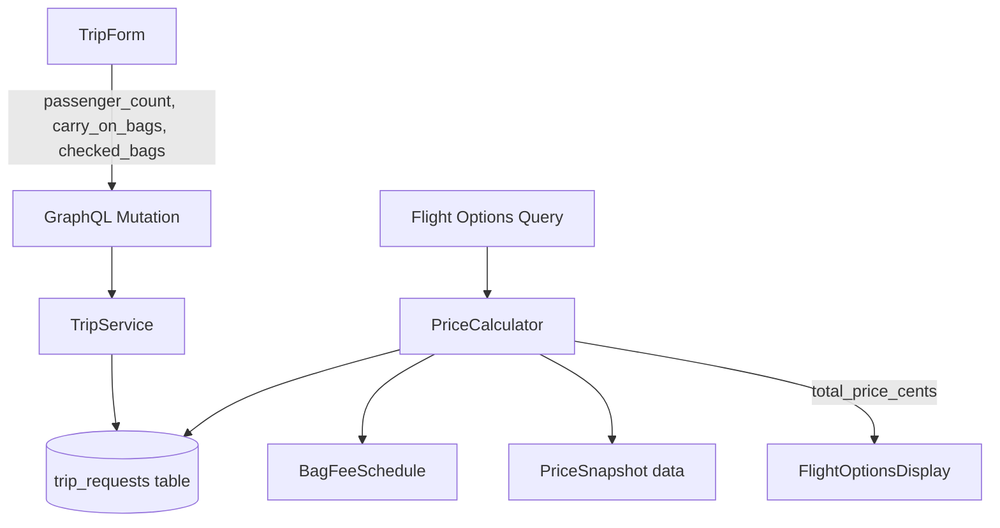

# Design Document: Passenger and Luggage Pricing

## Overview

This feature adds passenger count and luggage inputs to trip contracts, introduces an airline bag fee schedule, and computes an all-in total price: `(base_fare + bag_fees_per_passenger) × passenger_count`. The existing per-seat base fare display is replaced with a total party cost that includes ancillary bag fees.

Key changes:
- New columns on `trip_requests` table (passenger_count, carry_on_bags, checked_bags)
- A static bag fee schedule data module keyed by airline code
- A `PriceCalculator` service that computes total price from base fare + schedule + luggage config
- GraphQL schema extensions to expose new fields and computed prices
- Frontend form and display updates

## Architecture



The `PriceCalculator` is a pure function module that takes a base fare, airline code, and luggage config and returns the computed total. It has no side effects and no database access — it receives all inputs as arguments.

## Components and Interfaces

### PriceCalculator (`app/pricing/calculator.py`)

```python
@dataclass
class LuggageConfig:
    carry_on_bags: int  # 0-2
    checked_bags: int   # 0-5

@dataclass
class PriceBreakdown:
    base_fare_cents: int
    bag_fees_per_passenger_cents: int
    passenger_count: int
    total_price_cents: int  # (base_fare + bag_fees) * passenger_count

def calculate_total_price(
    base_fare_cents: int,
    airline_code: str,
    luggage: LuggageConfig,
    passenger_count: int,
) -> PriceBreakdown:
    """Pure function. Computes all-in price for the party."""
    ...

def get_bag_fees_per_passenger(
    airline_code: str,
    luggage: LuggageConfig,
) -> int:
    """Returns total bag fees in cents for one passenger."""
    ...
```

### BagFeeSchedule (`app/pricing/bag_fees.py`)

A Python dict constant keyed by airline code. Each entry contains fees for carry-on and checked bags (first, second, etc.).

```python
BAG_FEE_SCHEDULE: dict[str, AirlineBagFees]

@dataclass
class AirlineBagFees:
    carry_on_fee_cents: int          # fee per carry-on bag
    checked_bag_fees_cents: list[int] # [first_bag_fee, second_bag_fee, ...]
```

Lookup rules:
- If airline code is not in the schedule → all fees are 0
- Carry-on fee applies per carry-on bag
- Checked bag fees are positional: `checked_bag_fees_cents[0]` for the 1st bag, `[1]` for the 2nd, etc.
- If the passenger has more checked bags than entries in the list, use the last entry's fee for additional bags

### GraphQL Schema Changes (`app/graphql_api/schema.py`)

**TripRequestInput** — add optional fields:
- `passenger_count: Optional[int] = 1`
- `carry_on_bags: Optional[int] = 1`
- `checked_bags: Optional[int] = 0`

**TripRequestType** — expose:
- `passenger_count: int`
- `carry_on_bags: int`
- `checked_bags: int`

**FlightOptionType** — add:
- `total_price_cents: int`

**RoundTripOptionType** — add:
- `total_combined_price_cents: int`

### TripForm Changes (`frontend/src/components/TripForm.tsx`)

Add a "Passengers & Luggage" row below the time constraints:
- Passenger Count: number input, default 1, range [1, 9]
- Carry-On Bags: number input, default 1, range [0, 2]
- Checked Bags: number input, default 0, range [0, 5]

Validation errors display inline, same pattern as existing fields.

### FlightOptionsDisplay Changes

- Primary price column shows `total_price_cents` formatted as `$X`
- Secondary annotation shows per-passenger price when `passenger_count > 1` or bag fees > 0
- When `passenger_count == 1` and bag fees == 0, show only base fare (no annotation)

## Data Models

### Migration: `trip_requests` table

Add three columns with defaults matching backward-compatibility requirements:

```sql
ALTER TABLE trip_requests
  ADD COLUMN passenger_count INTEGER NOT NULL DEFAULT 1,
  ADD COLUMN carry_on_bags INTEGER NOT NULL DEFAULT 1,
  ADD COLUMN checked_bags INTEGER NOT NULL DEFAULT 0;
```

Constraints:
- `passenger_count` CHECK (passenger_count BETWEEN 1 AND 9)
- `carry_on_bags` CHECK (carry_on_bags BETWEEN 0 AND 2)
- `checked_bags` CHECK (checked_bags BETWEEN 0 AND 5)

### SQLAlchemy Model Update (`app/models.py`)

```python
class TripRequest(Base):
    # ... existing columns ...
    passenger_count = Column(Integer, nullable=False, default=1)
    carry_on_bags = Column(Integer, nullable=False, default=1)
    checked_bags = Column(Integer, nullable=False, default=0)
```

### Bag Fee Schedule Structure

```python
BAG_FEE_SCHEDULE = {
    "DL": AirlineBagFees(carry_on_fee_cents=0, checked_bag_fees_cents=[3500, 4500]),
    "AA": AirlineBagFees(carry_on_fee_cents=0, checked_bag_fees_cents=[3500, 4500]),
    "UA": AirlineBagFees(carry_on_fee_cents=0, checked_bag_fees_cents=[3500, 4500]),
    "WN": AirlineBagFees(carry_on_fee_cents=0, checked_bag_fees_cents=[0, 0]),
    "NK": AirlineBagFees(carry_on_fee_cents=4500, checked_bag_fees_cents=[4900, 5900]),
    "F9": AirlineBagFees(carry_on_fee_cents=5000, checked_bag_fees_cents=[4500, 5500]),
    # ... more airlines
}
```

## Correctness Properties

*A property is a characteristic or behavior that should hold true across all valid executions of a system — essentially, a formal statement about what the system should do. Properties serve as the bridge between human-readable specifications and machine-verifiable correctness guarantees.*

### Property 1: Input Validation Range

*For any* integer value and any luggage/passenger field, the validation function SHALL accept the value if and only if it falls within the allowed range for that field (passenger_count: [1,9], carry_on_bags: [0,2], checked_bags: [0,5]).

**Validates: Requirements 1.2, 1.3, 2.3, 2.4, 2.5**

### Property 2: Persistence Round-Trip

*For any* valid combination of passenger_count, carry_on_bags, and checked_bags values, saving a trip contract and then loading it SHALL yield the same values that were saved.

**Validates: Requirements 1.4, 2.6**

### Property 3: Price Calculation Round-Trip

*For any* valid base_fare (≥ 0), passenger_count (1–9), and luggage config, computing `total_price = (base_fare + bag_fees_per_passenger) × passenger_count` and then recovering the base fare via `total_price / passenger_count - bag_fees_per_passenger` SHALL yield the original base_fare exactly (integer arithmetic).

**Validates: Requirements 4.1, 4.2, 4.5**

### Property 4: Multi-Segment Airline Fee Selection

*For any* flight option with multiple segments operated by different airlines, the bag fee lookup SHALL use the airline code of the first segment only.

**Validates: Requirements 4.3**

### Property 5: Unknown Airline Fee Fallback

*For any* airline code that does not exist in the Bag_Fee_Schedule, the fee lookup SHALL return 0 cents for all bag types regardless of luggage config.

**Validates: Requirements 3.5**

### Property 6: Price Formatting

*For any* price value in cents, the display formatter SHALL produce a string matching the pattern `$N` where N is the integer dollar amount with no decimal places (cents truncated via integer division).

**Validates: Requirements 5.5**

## Error Handling

| Scenario | Behavior |
|----------|----------|
| Passenger count outside [1,9] | Frontend: inline validation error, prevent submit. Backend: TripValidationError raised. |
| Luggage values outside range | Frontend: inline validation error, prevent submit. Backend: TripValidationError raised. |
| Airline code not in bag fee schedule | Return 0 for all fees (graceful fallback, no error). |
| Negative base fare from data source | Treat as 0 (defensive clamp). |
| Multi-segment flight with empty segments | Use empty string as airline code → falls through to unknown airline fallback (0 fees). |
